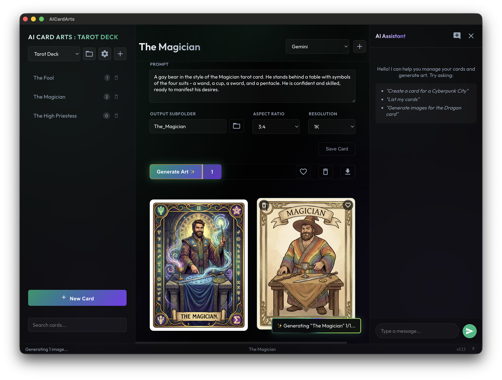
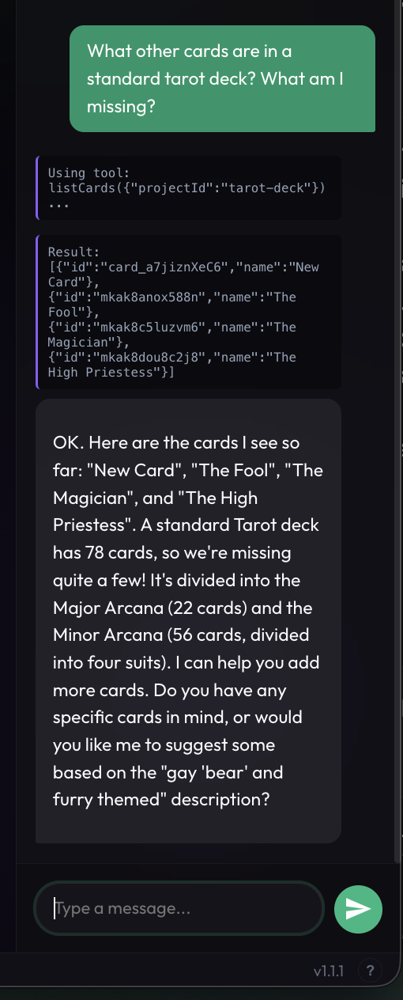

# AICardArts

A powerful, local web and desktop application for generating and managing consistent AI artwork for card collections (Tarot, TCGs, etc.) using the Google Gemini API.


*Modern, dark-themed interface with project organization and live gallery*

---

## ✨ Features

### 🎨 Core Features
-   **Project-Based Organization**: Group your cards into projects (e.g., "Cyberpunk Deck", "Tarot V2").
-   **Consistent Style**: Define global prompt prefixes and suffixes per project to ensure style consistency across all cards.
-   **Configurable Generation**:
    -   Set Defaults: Define default Aspect Ratio and Resolution for the entire project.
    -   Overrides: Override settings on a per-card basis.
    -   **Parallel Generation**: Generate 1-10 images at once with live status updates.
-   **Gallery & Organization**:
    -   View all generated images for a selected card.
    -   Click to view full details (Prompt, Date, Metadata).
    -   **Favorites**: Mark images as favorites with a simple click for quick access.
    -   **Archive**: Hide unwanted images without deleting them.
    -   **Gallery Download**: Download all currently visible images as a ZIP file (respects filters).
    -   **Search**: Quickly find cards by name using the search bar.

### 🤖 AI Assistant (NEW!)
-   **Intelligent Chat Interface**: A powerful AI assistant integrated directly into the app.
-   **Natural Language Commands**: Control the app through conversation:
    -   "Create a card for The Hermit with mystical vibes"
    -   "Generate 5 variations of the Dragon card"
    -   "List all my cards in this project"
    -   "Show me cards with the word 'forest' in the prompt"
-   **Tool Calling**: The AI can directly interact with your projects, cards, and generation settings.
-   **Context-Aware**: Automatically knows your current project and selected card.
-   **Multi-Turn Conversations**: Chat history is saved per project for ongoing workflows.
-   **Visual Tool Feedback**: See exactly what the AI is doing (searching, creating cards, generating images).


*AI Assistant helping you manage cards and generate art through natural conversation*

### 🖥️ Desktop Application (Electron)
-   Run as a standalone native app on macOS (and other platforms).
-   **Hybrid Mode (macOS)**: Can run headless in the taskbar with Chrome/browser as the main interface for a lightweight experience.
-   **Auto-Updates**: Automatically checks for and installs updates via GitHub Releases.
-   **Native Integration**: 
    -   System tray icon with quick actions
    -   Dock menu
    -   Native notifications for completed generations
    -   "Open in Finder" integration
    -   External link handling

### 🔒 Secure & Local
-   API Keys are stored locally (`data/keys.json`) and never shared.
-   Generated images are saved securely to your local disk (`data/output/`).
-   All processing happens on your machine.

### 🎯 Modern UI
-   Sleek, dark-themed interface with glassmorphism and smooth animations.
-   Responsive and immersive design.
-   Intuitive project/card navigation.
-   Live status updates and toast notifications.

---

## 🚀 Setup & Installation

### 1. Prerequisites
-   Node.js (v18 or higher recommended)
-   Yarn or NPM
-   A Google Gemini API Key ([Get one here](https://aistudio.google.com/apikey))

### 2. Install Dependencies
```bash
yarn install
```

### 3. Start the Server
```bash
yarn dev
```
The application will run at [http://localhost:5432](http://localhost:5432).

### 4. Desktop Application
This project can also be run as a standalone Desktop App (Electron).

**To run in dev mode:**
```bash
yarn electron:dev
```

**To build for your OS:**
```bash
yarn dist
```

**To build specifically for macOS (DMG + Zip):**
```bash
yarn build:mac
```
The packaged app will be created in `release/`. For Mac, look in `release/mac-arm64/` (or `mac/`).

**Hybrid Mode (macOS):**
You can also run the Electron app in the background (taskbar only) and access the interface through your regular browser:
1. Launch the Electron app
2. Use the tray menu to select "Open in Browser"
3. The app continues running in the background, providing native features (notifications, tray menu)
4. Access the UI at [http://localhost:5432](http://localhost:5432) in Chrome or any browser

This gives you the best of both worlds: native OS integration plus your preferred browser experience.

### 5. Auto-Updater (for Releases)
The app is configured to check for updates from the GitHub repository (`jrundquist/ai-art-cards`).

**To create a release:**
1. Ensure your GitHub token is set: `export GH_TOKEN=your_token`
2. Run the automation script:
   ```bash
   yarn release
   ```
3. Follow the prompts to select the version bump (patch, minor, major).
4. The script will automatically build, upload the artifacts to GitHub Releases, and push the tags.

---

## 📖 User Guide

### Getting Started

#### 1. API Keys
When you first load the app, click the **(+)** button next to the key selector (top right). 
-   Enter a **Name** (e.g., "My Gemini Key") for easy identification.
-   Paste your **API Key** from Google AI Studio.
-   Keys are saved locally and never leave your machine.

> **Tip**: You can manage multiple API keys and switch between them easily.

#### 2. Projects
-   Click **+ New Project** in the sidebar (or from the project selection screen).
-   **ID**: A unique, short identifier (e.g., `forest-spirits`). *Cannot be changed later*.
-   **Name**: Display name for your project (e.g., "Forest Spirits Tarot").
-   **Description**: Optional description to help the AI assistant understand your project.
-   **Output Dir**: Subfolder in `data/output` where images will be saved.
-   **Global Prefix/Suffix**: Text automatically appended to every prompt for consistency.
    -   Example Prefix: `"A mystical forest spirit tarot card, oil painting style, fantasy art,"`
    -   Example Suffix: `"high quality, detailed, professional card art"`

> **Editing Projects**: Click the **Settings Cog (⚙️)** next to the project name to edit settings later.

#### 3. Cards
-   Select a project, then click **+ New Card**.
-   **Name**: The card's title (e.g., "The Hermit", "Fire Dragon").
-   **ID**: Auto-generated unique identifier. Can be customized if needed.
-   **Prompt**: Describe the specific subject (e.g., "An old wise hermit in a snowy mountain").
-   **Previews**: The "Preview" box shows you exactly what text will be sent to the AI (including prefix/suffix).
-   **Overrides**: 
    -   Override Aspect Ratio or Resolution for specific cards if needed.
    -   Override Output Subfolder to organize images differently.

#### 4. Generating Art
-   Select a card from the list.
-   (Optional) Enter an "Idea/Concept" in the text box to temporarily tweak the prompt for this generation.
-   Set the **Count** (1-10) for how many variations to generate.
-   Click **Generate Art**.
-   Watch the progress in the status bar (bottom right).
-   Images will appear in the gallery below as they're completed.

> **Desktop App**: You'll receive native notifications when images finish generating, even if the app is in the background.

### Managing Images

#### Gallery View
-   **View All**: See all generated images for the selected card.
-   **Favorites Filter**: Click the star icon to show only favorited images.
-   **Archive Filter**: Click the archive icon to show only archived images.
-   **Download**: Click the download button to get a ZIP of all currently visible images.

#### Image Details
-   **Click any image** to open the detail modal:
    -   View full-size image
    -   See the exact prompt used
    -   View generation date and metadata
    -   **Favorite**: Click the star to mark as favorite (press `F` when viewing)
    -   **Archive**: Hide the image from the default gallery view
    -   **Navigate**: Use arrow keys to browse through images

#### Favorites
-   Click the **star icon** on any image (in the gallery or detail view) to mark it as a favorite.
-   Favorited images get a gold star badge.
-   Use the favorites filter in the gallery to see only your best picks.
-   Press `F` while viewing an image to quickly toggle favorite status.

### Using the AI Assistant

#### Opening the Chat Panel
-   Click the **chat icon** in the top-right corner to open the AI Assistant.
-   The panel slides in from the right and remembers its open/closed state.

#### What the AI Can Do
The AI Assistant has access to powerful tools and can help you with:

-   **List & Search**: "Show me all my cards", "Find cards about dragons"
-   **Create Cards**: "Create a new card called 'The Moon' with a celestial theme"
-   **Update Cards**: "Change the prompt for The Hermit to include snow"
-   **Generate Art**: "Generate 3 images for this card", "Create 5 variations with different lighting"
-   **Get Information**: "What's in my current project?", "What projects do I have?"

#### Example Conversations
```
You: "Create a card for The Tower with a dramatic stormy scene"
AI: *Creates the card and confirms*

You: "Now generate 4 versions of it"
AI: *Starts generation and shows progress*

You: "Which cards have 'dragon' in them?"
AI: *Searches and lists matching cards*
```

#### Tips for Best Results
-   Be specific about what you want the AI to do.
-   The AI knows your current project and selected card automatically.
-   Chat history is saved per project, so you can continue conversations later.
-   Click the suggested prompts when starting a new chat for inspiration.

---

## ⌨️ Keyboard Shortcuts

| Shortcut | Action |
|----------|--------|
| `?` or `/` | Open Help Modal |
| `Esc` | Close any open modal |
| `Enter` | Send chat message (when in chat input) |
| `Shift+Enter` | New line in chat (without sending) |
| **When viewing an image:** | |
| `←` / `→` | Navigate previous/next image |
| `↑` / `↓` | Navigate previous/next image |
| `F` | Toggle favorite |
| **When editing card title:** | |
| `Enter` | Save changes |
| `Esc` | Cancel editing |

---

## 💡 Prompt Engineering Tips

### Writing Better Prompts

1. **Be Specific**: Instead of "a dragon", try "a majestic red dragon with golden scales perched on a mountain peak"

2. **Use Quality Modifiers**: Include terms like:
   -   "high quality", "detailed", "professional"
   -   "oil painting", "digital art", "watercolor"
   -   "fantasy art", "concept art", "tarot card style"

3. **Leverage Global Prefix/Suffix**: 
   -   Put style and quality terms in the project prefix/suffix
   -   Keep individual card prompts focused on the subject
   -   This ensures consistency across all cards

4. **Aspect Ratio Matters**:
   -   Tarot cards: Try 2:3 or 9:16 (portrait)
   -   Playing cards: Use 2.5:3.5 or similar
   -   Landscape scenes: Use 16:9 or 3:2

5. **Iterate**: Generate multiple versions and favorite the best ones

### Example Setup
```
Project: "Elemental Tarot"
Prefix: "A mystical tarot card illustration, fantasy art style, "
Suffix: ", magical atmosphere, professional card design, highly detailed"

Card: "Fire Element"
Prompt: "a swirling vortex of flames and embers with a phoenix rising"

Final sent to AI:
"A mystical tarot card illustration, fantasy art style, a swirling vortex 
of flames and embers with a phoenix rising, magical atmosphere, 
professional card design, highly detailed"
```

---

## 🆘 FAQ & Troubleshooting

### Common Issues

**Q: I get "Unauthorized" or "API Key" errors**
-   Make sure you've selected an API key from the dropdown (top right)
-   Verify your API key is valid at [Google AI Studio](https://aistudio.google.com/apikey)
-   Try adding the key again if issues persist

**Q: Generation fails with "Safety Block" error**
-   The AI refused your prompt due to content safety filters
-   Try rephrasing to be less explicit or violent
-   Check the exact prompt in the terminal/console for details

**Q: Images aren't generating**
-   Check the status bar (bottom right) for error messages
-   Look at the terminal/console for detailed logs
-   Ensure your API key has quota remaining
-   Verify your internet connection

**Q: Chat history not loading**
-   Make sure you have an API key selected before opening projects
-   Chat history is stored per-project in `data/conversations/`
-   Try refreshing the page if the chat panel seems stuck

**Q: Desktop app won't update**
-   Check your internet connection
-   Updates are published to GitHub Releases
-   You can manually download the latest release from the repository

**Q: Where are my images saved?**
-   Images are in `data/output/<project-output-dir>/<card-subfolder>/`
-   Use "Open Folder" button (folder icon) to view in Finder/Explorer
-   In the image detail modal, click the file path to open the folder (Desktop app only)

**Q: Can I use this offline?**
-   No, the app requires internet to connect to Google's Gemini API
-   However, all your data (projects, cards, chat history) is stored locally

### Getting More Help

-   **Check Logs**: The terminal where you ran `yarn dev` shows detailed logs
-   **Status Notifications**: Watch the toast notifications in the bottom right for real-time status
-   **Console**: Open Developer Tools (F12) to see client-side errors
-   **GitHub Issues**: Report bugs or request features at the repository

---

## 🎯 What's New in v1.3

### ✨ Major Features
-   **AI Assistant Integration**: Powerful chat interface with tool calling
-   **Multi-Turn Conversations**: Chat history saved per project
-   **Enhanced Desktop Experience**: Tray menus, native notifications, better system integration
-   **Gallery Download**: Export visible images as ZIP
-   **Favorites System**: Mark and filter your best images

### 🔧 Improvements
-   Better error logging throughout the app
-   Persistent chat panel state
-   Context-aware AI with access to current project/card
-   Improved project selection UI
-   Enhanced Electron native features
-   Better external link handling

### 🐛 Bug Fixes
-   Fixed notification navigation to correct cards
-   Improved CORS and API key handling
-   Better error messages for generation failures
-   Fixed chat history loading race conditions

---

## 🛠️ Development

### Project Structure
```
ai-art-cards/
├── src/
│   ├── lib/              # Backend services
│   │   ├── chat_service.ts      # AI chat & tool calling
│   │   ├── data_service.ts      # Project/card management
│   │   ├── image_generator.ts   # Image generation
│   │   └── system_instruction.ts # AI system prompt
│   ├── public/           # Frontend files
│   │   ├── index.html
│   │   ├── styles.css
│   │   └── js/
│   │       ├── chat.js          # Chat UI controller
│   │       ├── main.js          # App initialization
│   │       └── controllers/     # Feature controllers
│   ├── server.ts         # Express server
│   └── electron.ts       # Electron main process
├── data/                 # User data (gitignored)
│   ├── keys.json
│   ├── output/
│   └── conversations/
├── docs/
│   └── screenshots/      # Documentation images
└── build/                # Build assets
```

### Available Scripts
-   `yarn dev` - Start development server
-   `yarn build` - Compile TypeScript
-   `yarn electron:dev` - Run Electron in dev mode
-   `yarn dist` - Build for all platforms
-   `yarn build:mac` - Build for macOS
-   `yarn release` - Create a new release

---

## 🚀 Future Roadmap

Interested in what's coming next? Check out our [**Roadmap**](docs/ROADMAP.md) for planned features including:
- Image-to-image generation
- Advanced export options (print-ready, contact sheets, CSV)
- Enhanced organization (tags, categories, advanced search)
- Side-by-side comparison tools
- Batch operations and automation
- And much more!

Have a feature idea? Check the roadmap and contribute your suggestions!

---

## 📄 License

This project is private/proprietary. All rights reserved.

---

*Co-developed with AI in Antigravity.*
